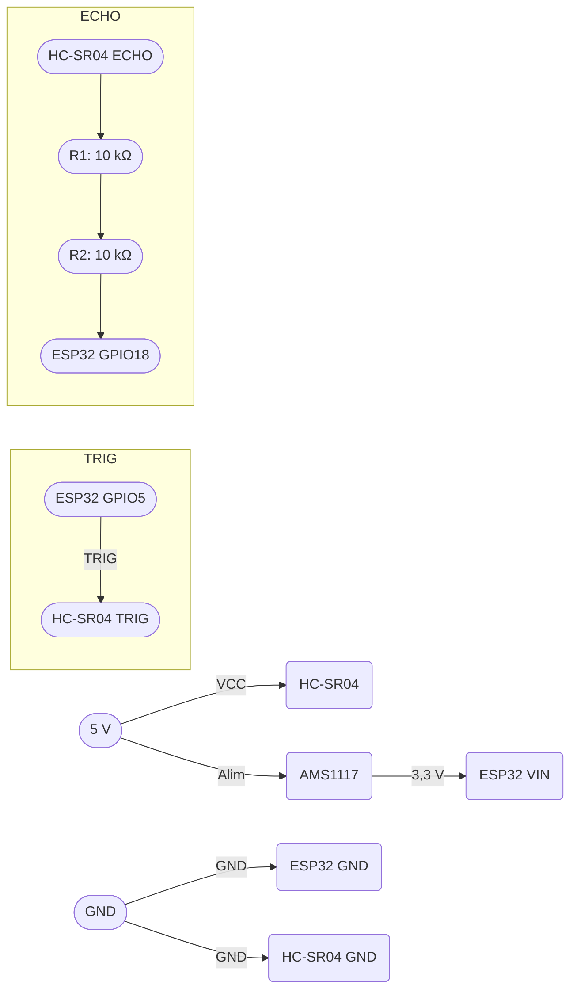

# IOT

## 1. Contexte et objectif

Concevoir un projet théorique d’IoT visant à équiper un distributeur
automatique avec un capteur connecté, à des fins de suivi ou d’optimisation (par
exemple : température, ouverture, niveau de remplissage, fréquentation...).

Le dispositif reposera sur un microcontrôleur ESP32 avec une connexion Wi-Fi.

---

## 2. Choix du capteur

-   **Capteur Ultrason** : **HC-SR04**
-   **Fonction** : Mesure la distance entre le haut du réservoir et la surface des produits.
-   **Portée** :
-   **Justification** :
    -   Coût faible.
    -   Peut mesurer une distance comprise entre 3cm et 4m en théorie. En pratique, entre 10cm et 2.5m.

---

## 3. Composants et intégration

| Composant                  | Rôle                                              |
| -------------------------- | ------------------------------------------------- |
| **ESP32**                  | Microcontrôleur Wi-Fi                             |
| **HC-SR04**                | Mesure de distance sans contact                   |
| **Régulateur AMS1117**     | Alimentation en 3,3V de l’ESP32 à partir de 5V    |
| **Résistances 10 kΩ (×2)** | Pont diviseur pour abaisser le signal ECHO à 3,3V |
| **Fils Dupont**            | Connexions rapides sur breadboard                 |
| **Breadboard**             | Montage prototype                                 |
| **Alimentation 5V, 2A**    | Source d’énergie pour l’ESP32 et le HC-SR04       |

### Justification des composants

-   **Régulateur AMS1117**  
    L’ESP32 fonctionne à 3,3V. Même si les cartes ESP32 intègrent un régulateur, il est préférable de fournir un 5V stable puis de le ramener à 3,3V via un module AMS1117 pour garantir un bon courant.

-   **Résistances 10 kΩ (×2)**  
    Le capteur HC-SR04 émet le signal ECHO à 5V. L’ESP32 n’accepte que 3,3V sur ses GPIOs. Nécessaire pour abaisser la tension à 3,3V.

-   **Fils Dupont**  
    Permet de connecter l’ESP32, le capteur, le régulateur et l’alimentation sur un breadboard.

-   **Breadboard**  
    Permet de tester facilement le projet. Les connexion entre chaque module sont simple à réaliser.

-   **Alimentation 5V, 2A**  
    L’ESP32 peut tirer au maximum jusqu'à 240mA, et le HC-SR04 consomme 15 mA. Une alimentation 5V / 2A est suffisant et garantie une marge de sécurité pour des ajouts futurs.

---

## 4. Schéma de cablage



## 5. Code Arduino

```cpp
const int trig_pin = 5;
const int echo_pin = 18;

// Vitesse du son dans l'air
#define SOUND_SPEED 340
#define TRIG_PULSE_DURATION_US 10


long ultrason_duration;
float distance_cm;

void setup() {
  Serial.begin(115200);
  pinMode(trig_pin, OUTPUT); // On configure le trig en output
  pinMode(echo_pin, INPUT); // On configure l'echo en input
}

void loop() {
  // Prepare le signal
  digitalWrite(trig_pin, LOW);
  delayMicroseconds(2);
  // Créer une impulsion de 10 µs
  digitalWrite(trig_pin, HIGH);
  delayMicroseconds(TRIG_PULSE_DURATION_US);
  digitalWrite(trig_pin, LOW);

  // Renvoie le temps de propagation de l'onde (en µs)
  ultrason_duration = pulseIn(echo_pin, HIGH);

  // Calcul de la distance
  distance_cm = ultrason_duration * SOUND_SPEED/2 * 0.0001;

  // On affiche la distance sur le port série
  Serial.print("Distance (cm): ");
  Serial.println(distance_cm);

  delay(1000);
}
```
